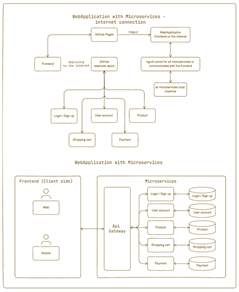

WebApplication Gateway API

This is the Gateway API designed to seamlessly bridge the gap between my frontend and 
the array of backend microservices!

Functioning as a microservice itself, it stands as a central gateway through which 
all other microservices can be accessed. Its role is to execute methods that are 
user-facing, allowing clients to interact with various services.

This project is a crucial element of my ongoing endeavor to transition from a monolithic 
WebApplication architecture to a more dynamic microservices' architecture.

For a clearer understanding, refer to the diagram below:

